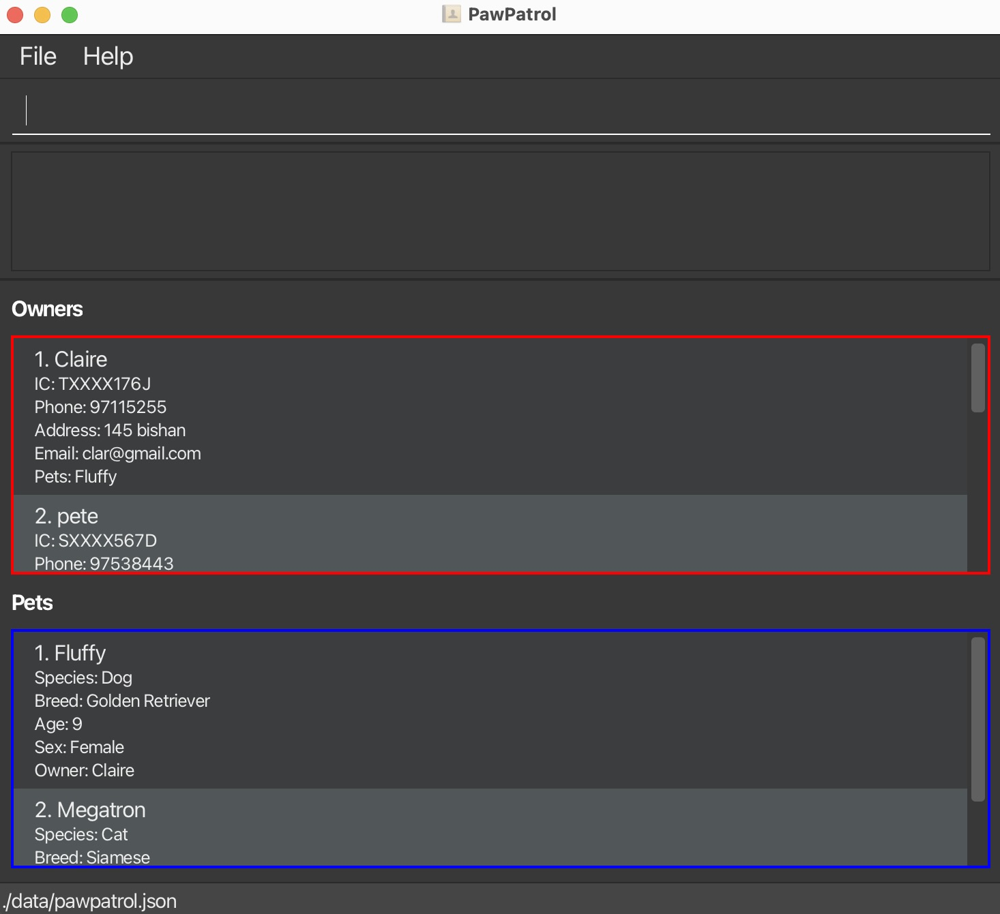
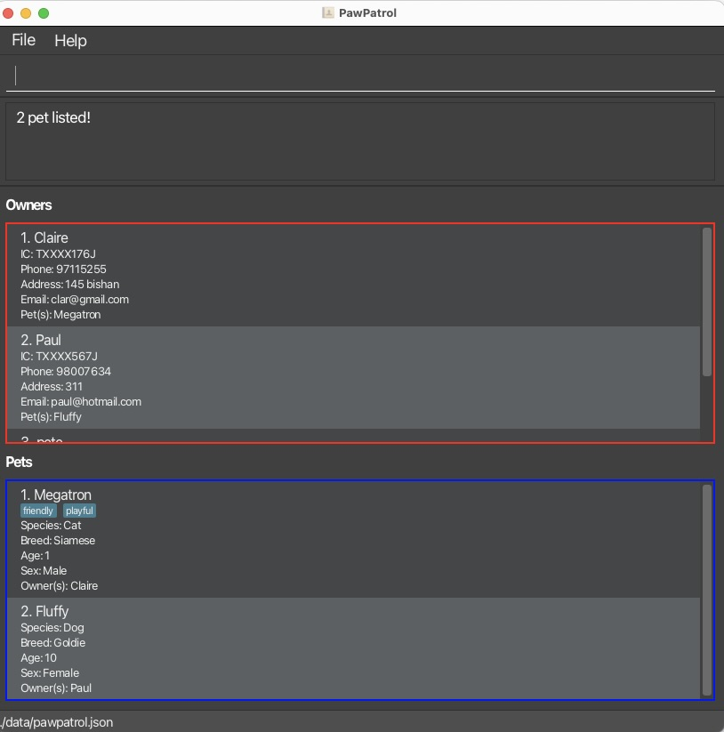
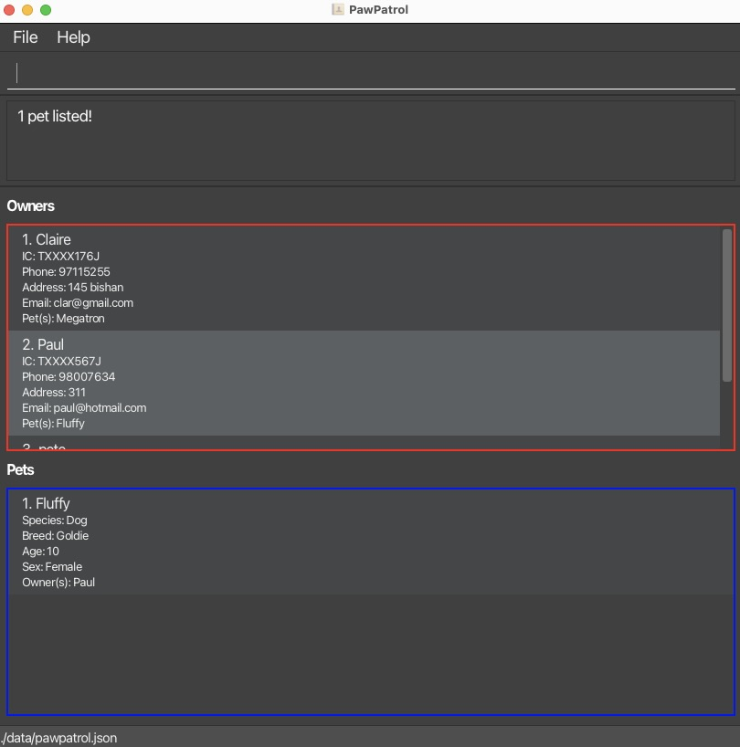

PawPatrol is a **desktop app to help veterinary clinics manage their patient data**. It allows the clinic to add and edit 2 types of
entities, owners and pets. PawPatrol also allows the user to link owners to pets, allowing the user
to easily see at a glance which pets belong to which owner. It is optimised
for use via a Command Line Interface** (CLI) which improves use speed while still having the user-friendliness of a Graphical User Interface (GUI).
If you can type fast, PawPatrol can manage patient owner and pet data faster than traditional organisation apps.

* Table of Contents
{:toc}

--------------------------------------------------------------------------------------------------------------------

## Quick start

1. Ensure you have Java `17` or above installed in your Computer.

1. Download the latest `.jar` file from [here](https://github.com/se-edu/pawpatrol/releases).

1. Copy the file to the folder you want to use as the _home folder_ for PawPatrol.

1. Open a command terminal, `cd` into the folder you put the jar file in, and use the `java -jar pawpatrol.jar` command to run the application. 
   A GUI similar to the image below should appear in a few seconds. Note how the app contains some sample data. 
   

1. Type the command in the command box and press Enter to execute it. e.g. typing **`help`** and pressing Enter will open the help window. 
   Some example commands you can try:

   * `list both` : Lists all owners and pets.

   * `owner n/John Doe p/98765432 e/johnd@example.com a/311, Clementi Ave 2, #02-25` : Adds a contact named `John Doe` to PawPatrol.

   * `delete o3` : Deletes the 3rd owner shown in the current list.

   * `link o1 t/p1` : Links 1st owner shown to 1st pet shown.

   * `clear` : Deletes all owners and pets in PawPatrol.

   * `exit` : Exits the app.

1. Refer to the [Features](#features) below for details of each command.

--------------------------------------------------------------------------------------------------------------------

## Features

**:information_source: Notes about the command format:** 

* Words in `UPPER_CASE` are the parameters to be supplied by the user. 
  e.g. in `owner n/NAME`, `NAME` is a parameter which can be used as `owner n/John Doe`, and in `delete oOWNER_INDEX`, `OWNER_INDEX` is a parameter which can be used as `delete o1`.

* Items in square brackets are optional. 
  e.g. `n/NAME [t/TAG]` can be used as `n/Fluffy t/friendly` or as `n/Fluffy`.

* Items with `…`​ after them can be used multiple times including zero times. 
  e.g. `[t/TAG]…​` can be used as ` ` (i.e. none specified), `t/friendly`, `t/friendly t/skiddish` etc.

* Parameters can be in any order. 
  e.g. if the command specifies `n/NAME p/PHONE_NUMBER`, `p/PHONE_NUMBER n/NAME` is also acceptable.

* Extraneous parameters for commands that do not take in parameters (such as `help`, `list owners`, `list pets` and `exit`) will be ignored. 
  e.g. if the command specifies `help 123`, it will be interpreted as `help`.

* If you are using a PDF version of this document, be careful when copying and pasting commands that span multiple lines as space characters surrounding line-breaks may be omitted when copied over to the application.

### Viewing help : `help`

Shows a message explaining how to access the help page as shown below.

Format: `help`

### Adding an entity: `owner` / `pet`

#### <u>Adding an Owner</u>

Adds an owner to PawPatrol.

Format: `owner i/IC_NUMBER n/NAME p/PHONE e/EMAIL a/ADDRESS`

Examples:
* `owner i/S1234567D n/John Doe p/98765432 e/johnd@example.com a/311, Clementi Ave 2, #02-25`

#### <u>Adding a pet</u>

Adds a pet to PawPatrol.

:bulb: **Tip:**
A pet can have any number of tags (including 0)

Format: `pet n/NAME s/SPECIES b/BREED a/AGE x/SEX [t/TAG]…​`

Examples:
* `pet n/Fluffy s/Dog b/Golden Retriever a/7 x/F`
* `pet n/Megatron s/Cat b/Siamese a/3 x/M t/playful`

### Linking owners and pets: `link`

Links an owner to one or more pets.

**:exclamation: Extra information:** 
  
* Links owner at specified `OWNER_INDEX` to pet(s) at specified `PET_INDEX`s. 
  
* An owner can be linked to 0 or more pets. 
  
* A pet can be linked to 0 or more owners. 
  

Format: `link oOWNER_INDEX t/pPET_INDEX…​`

Examples:
* `link o1 t/p1`
* `link o2 t/p2 t/p3`

<em>Link between Tricia (owner) and Fluffy (pet)</em>

### Unlinking entities: `unlink`

Unlinks an owner to one or more pets.

Format: `unlink oOWNER_INDEX t/pPET_INDEX…​`

:exclamation: **Extra information:** 
  
Unlinks owner at specified `OWNER_INDEX` to pet(s) at specified `PET_INDEX`s.
  

Examples:
* `unlink o1 t/p1`
* `unlink o2 t/p2 t/p3`

### Listing entities: `list`

Shows a list of desired entities in PawPatrol.

Format:
* `list owners`: Shows a list of all owners.
* `list pets`: Shows a list of all pets.
* `list both`: Shows both owners and pets in a consolidated view.

### Editing entities: `edit`

Edits an existing owner or pet in PawPatrol.

**:exclamation: Extra information:** 

* Edits the owner or pet at the specified `OWNER_INDEX` or `PET_INDEX` respectively. The index refers to the index number shown in the displayed owner or pet list. The index **must be a positive integer** 1, 2, 3, …​ 

* At least one of the optional fields must be provided. 

* IC number cannot be changed. 

* Existing values will be updated to the input values. 

* When editing tags, the existing tags of the pet will be removed i.e. adding of tags is not cumulative. 

* You can remove all the pet’s tags by typing `t/` without specifying any tags after it. 

#### <u>Editing an owner</u>

Format:
* `edit oOWNER_INDEX [n/NAME] [p/PHONE] [e/EMAIL] [a/ADDRESS]`: Edits an existing owner in PawPatrol.

Example:
*  `edit o1 p/91234567 e/johndoe@example.com` Edits the phone number and email address of the 1st owner to be `91234567` and `johndoe@example.com` respectively.

#### <u>Editing a pet</u>

Format:
* `edit pPET_INDEX [n/NAME] [s/SPECIES] [b/BREED] [a/AGE] [x/SEX] [t/TAG]…​`: Edits an existing pet in PawPatrol.

Example:
*  `edit p2 n/Fluffy t/` Edits the name of the 2nd pet to be `Fluffy` and clears all existing tags.

### Finding entities by name: `find`

Finds owners or pets whose names contain any of the given keywords.

**:exclamation: Extra information:** 

* The search is case-insensitive. e.g. `hans` will match `Hans` 

* The order of the keywords does not matter. e.g. `Hans Bo` will match `Bo Hans` 

* Only the name is searched. 

* Only full words will be matched e.g. `Han` will not match `Hans` 

* Owners or pets matching at least one keyword will be returned (i.e. `OR` search). 
  e.g. `Hans Bo` will return `Hans Gruber`, `Bo Yang`

Format: 
* `find owner KEYWORD [MORE_KEYWORDS]`: Finds owners whose names contain any of the given keywords.
* `find pet KEYWORD [MORE_KEYWORDS]`: Finds pets whose names contain any of the given keywords.

Examples:
* `find owner John` returns `john` and `John Doe` in the owners list panel.
* `find pet fluffy megatron` returns `Fluffy`, `Megatron` as shown in the image below. 
  

### Deleting an entity : `delete`

Deletes the specified owner or pet from PawPatrol.

**:exclamation: Extra information:** 

* Deletes the owner or pet at the specified `OWNER_INDEX` or `PET_INDEX` respectively. 

* The index refers to the index number shown in the displayed owner or pet list. 

* The index **must be a positive integer** 1, 2, 3, …​ 

Format:
* `delete oOWNER_INDEX`: Deletes the specified owner from PawPatrol.
* `delete pPET_INDEX`: Deletes the specified pet from PawPatrol.

Examples:
* `list owners` followed by `delete o2` deletes the 2nd person in PawPatrol.
* `find owner Betsy` followed by `delete o1` deletes the 1st owner in the results of the `find` command.
* `list pets` followed by `delete p2` deletes the 2nd pet in PawPatrol.
* `find pet Fluffy` followed by `delete p1` deletes the 1st pet in the results of the `find` command, as shown below.
  
  

    <em>Result for 'find Fluffy'</em>
  

  
  
<em>Result for 'delete p1' after 'find Fluffy'</em>

### Sorting : `sort`

View owners or pets in PawPatrol sorted by their names in alphabetical order.

Format:
* `sort owners`: Sorts owners by name in alphabetical order.
* `sort pets`: Sorts pets by name in alphabetical order.

### Clearing all entries : `clear`

Clears all owners and pets in PawPatrol.

Format: `clear`

:exclamation: **Warning:**
This action is irreversible! Please make a backup of the <a href="#for-advanced-users-updating-pawpatrol-data-directly">data file</a> should you wish to retain past data.

### Exiting the program : `exit`

Exits PawPatrol. This is equivalent to clicking the "X" icon to close the app.

Format: `exit`

### Finding unlinked pets and owners  `[coming in v2.0]`

_Details coming soon ..._

## For Advanced Users: Updating PawPatrol Data Directly

### Saving the data

PawPatrol data is saved on your computer automatically after any command that changes the data. There is no need to save manually.

It is saved automatically as a JSON file located in `[JAR file location]/data/pawpatrol.json`.

### Saving a backup data file

PawPatrol does not automatically backup your data. To do so, copy the JSON file (as mentioned above) into another location on your computer or to another device.

### Editing the data file

Advanced users are welcome to update data directly by editing that data file.

:exclamation: **Caution:**
If your changes to the data file makes its format invalid, PawPatrol will <b>discard all data</b> and start with an empty data file at the next run. Hence, it is recommended to take a <a href="#saving-a-backup-data-file">backup</a> of the file before editing it. 
Furthermore, certain edits can cause PawPatrol to behave in unexpected ways (e.g., if a value entered is outside of the acceptable range). Therefore, edit the data file only if you are confident that you can update it correctly.

### Automatic backup data files `[coming in v2.0]`

_Details coming soon ..._

--------------------------------------------------------------------------------------------------------------------

## FAQ

**Q**: How do I transfer my data to another computer? 
**A**: Install the app in the other computer and overwrite the empty data file it creates with the file that contains the data of your previous PawPatrol home folder.

--------------------------------------------------------------------------------------------------------------------

## Known issues

1. **If you minimize the Help Window** and then run the `help` command (or use the `Help` menu, or the keyboard shortcut `F1`) again, the original Help Window will remain minimized, and no new Help Window will appear. The remedy is to manually restore the minimized Help Window.
2. **Accidental clearing of data** using the `clear` command may lead to data being lost. [Backups of the data file](#saving-a-backup-data-file) should be made frequently by copying out the JSON file to another location on your computer.
3. **When using multiple screens**, if you move the application to a secondary screen, and later switch to using only the primary screen, the GUI will open off-screen. The remedy is to delete the `preferences.json` file created by the application before running the application again. This file can be found in `[JAR file location]/data/preferences.json` similar to [other data files](#saving-the-data).

--------------------------------------------------------------------------------------------------------------------

## Command summary

Action | Format, Examples
--------|------------------
**Add Owner** | `owner n/NAME p/PHONE e/EMAIL a/ADDRESS`   e.g., `owner n/John Doe p/98765432 e/johnd@example.com a/311, Clementi Ave 2, #02-25`
**Add Pet** | `pet n/NAME s/SPECIES b/BREED a/AGE sex/SEX [t/TAG]…​`   e.g., `pet n/Megatron s/Cat b/Siamese a/3 x/M t/playful`
**Clear** | `clear`
**Delete Owner** | `delete oOWNER_INDEX`  e.g., `delete o3`
**Delete Pet** | `delete pPET_INDEX`  e.g., `delete p2`
**Edit Owner** | `edit oOWNER_INDEX [n/NAME] [p/PHONE_NUMBER] [e/EMAIL] [a/ADDRESS]`  e.g.,`edit o2 n/James Lee e/jameslee@example.com`
**Edit Pet** | `edit pPET_INDEX [n/NAME] [s/SPECIES] [b/BREED] [a/AGE] [x/SEX] [t/TAG]…​`  e.g.,`edit p2 n/George a/2`
**Find Owner** | `find owner KEYWORD [MORE_KEYWORDS]`  e.g., `find James Jake`
**Find Pet** | `find pet KEYWORD [MORE_KEYWORDS]`  e.g., `find Fluffy`
**Link** | `link oOWNER_INDEX t/pPET_INDEX…​`   e.g., `link o1 t/p1 t/p2`
**Unlink** | `unlink oOWNER_INDEX t/pPET_INDEX…​`   e.g., `unlink o1 t/p1 t/p2`
**List Owners** | `list owners`
**List Pets** | `list pets`
**List Owners and Pets** | `list both`
**Sort Owners** | `sort owners`
**Sort Pets** | `sort pets`
**Help** | `help`
